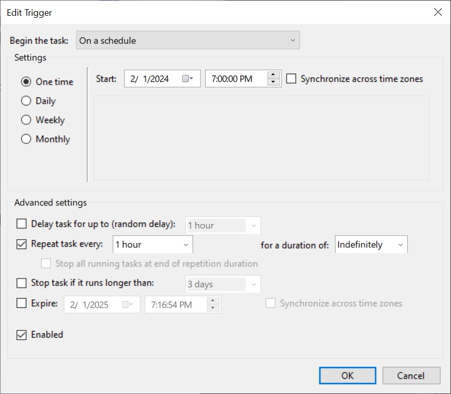

# Dedicated Server Backup Script

Before use you'll probably want to make a few edits to the script:

*   What are we backing up? `source_dir`=C:\palworld\Pal\Saved\SaveGames\
*   Where is it going? `destination_dir`=C:\palbackup\
*   How many backups do you want to keep? `max_name`=72"

This script is designed to be triggered by Windows Task Scheduler 

